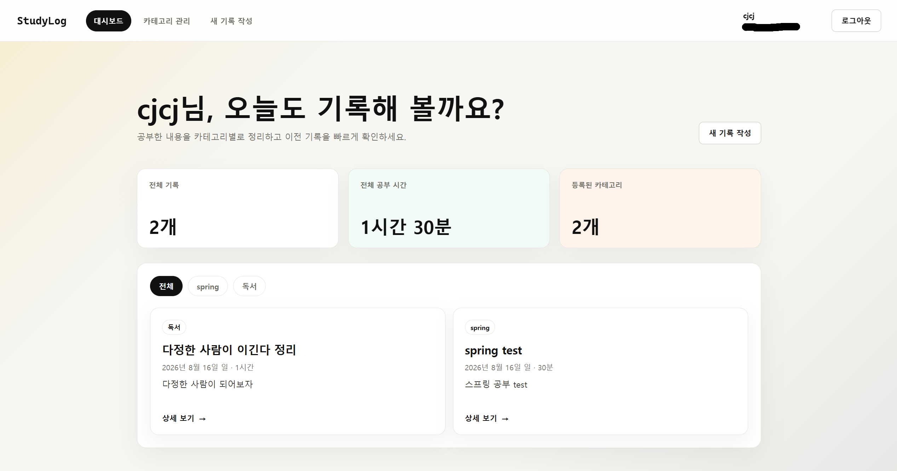

# 📚 StudyLog

공부한 내용을 카테고리별로 기록하고 관리하는 개인 학습 기록 웹 애플리케이션입니다.

## 실행 화면


## 💡 만든 이유

공부한 내용이 여러 노트에 흩어지지 않도록 한곳에 기록하고, 날짜와 카테고리별로 간편하게 확인하기 위해 만들었습니다.

Spring Boot로 REST API를 구현하고 React 프론트엔드와 직접 연결했으며, JWT 인증을 적용하여 사용자마다 자신의 기록만 관리할 수 있도록 했습니다.

## ✨ 주요 기능

- 회원가입 및 로그인
- JWT 기반 사용자 인증
- 카테고리 생성·조회·수정·삭제
- 공부 기록 생성·조회·수정·삭제
- 카테고리별 공부 기록 필터링
- 전체 공부 시간과 기록 수 확인
- 반응형 웹 화면

## 🛠 사용 기술

### Backend

- Java
- Spring Boot
- Spring Data JPA
- Spring Security, JWT
- MySQL
- Gradle

### Frontend

- React
- TypeScript
- Vite
- React Router
- Axios
- CSS

## 🖥 실행 화면

<!--
이미지를 images 폴더에 추가한 뒤 아래 주석을 해제하세요.


-->

## 📂 프로젝트 구조

```text
StudyLog/
├─ studylog/             # Spring Boot backend
└─ studylog-frontend/    # React frontend
```

## 🚀 실행 방법

### 저장소 복제

```bash
git clone https://github.com/CJ-JONG/StudyLog.git
cd StudyLog
```

### 백엔드 실행

MySQL과 JWT 환경변수를 설정한 후 실행합니다.

```powershell
cd studylog
.\gradlew.bat bootRun
```

백엔드는 `http://localhost:8080`에서 실행됩니다.

### 프론트엔드 실행

새 터미널에서 실행합니다.

```bash
cd studylog-frontend
npm install
npm run dev
```

브라우저에서 `http://localhost:5173`에 접속합니다.

## 🔐 인증 방식

로그인에 성공하면 발급된 JWT access token을 보호된 API 요청에 첨부합니다.

```http
Authorization: Bearer <accessToken>
```

프론트엔드는 `memberId`를 직접 보내지 않으며, 백엔드가 JWT에서 현재 사용자를 확인합니다.

## 🔮 앞으로 추가할 기능

- 공부 기록 검색 및 기간 필터
- 카테고리별 공부 시간 통계
- Refresh token 적용
- Docker 및 배포 자동화

## 👨‍💻 만든 사람

- GitHub: [CJ-JONG](https://github.com/CJ-JONG)
